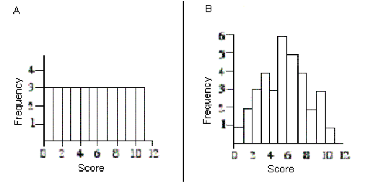
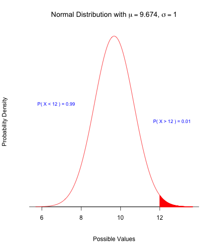
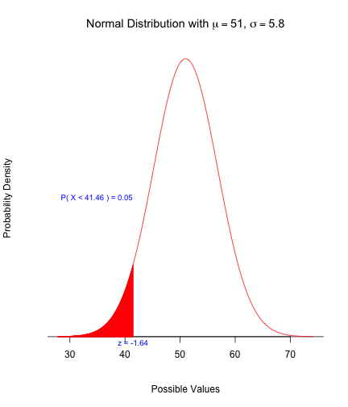
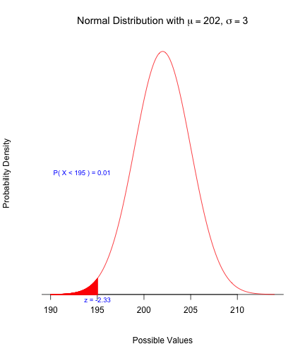

## Question 1


Each of the following two histograms represents the distribution of acceptance rates (percent accepted) among 25 business schools in 2005.  The histograms use different class intervals, but are based on the same data.  In each class interval, the left endpoint is included but not the right. 


--- &radio

## Question 1A ##

What percent of the schools have an acceptance rate of less than 20%?

1. 12%
2. 3%
3. _16%_
4. 4%

*** .explanation

From the histogram on the left, we see that 4 out of the 25 schools have an acceptance rate of < 20%. Hence, the answer is 16%.

--- &radio

## Question 1B

Which interval contains fewer than half of all the observations?
 
1. _[30% , 45%)_
2. [25%, 40%)
3. [22.5%, 37.5%)
4. [20%, 35%)

*** .explanation

Inspecting the histogram carefully, we find that only 11 out of 25 schools have an acceptance rate in the range 30% to 45%.

--- .segue .dark .nobackground

## Question 2

--- &radio

## Question 2A ##

A study is conducted to determine if one can predict the price of a stock based on the price-to-earnings ratio.  The response variable in this study is:

1. the price-to-earnings ratio.
2. either the NASDAQ or the Dow Jones Industrial Average.
3. the researcher.
4. _price of the stock._

*** .explanation

We are trying to predict stock price. Hence it is the response variable

--- &radio

## Question 2B ##

A researcher is interested in determining if one could predict the score on a statistics exam from the amount of time spent studying for the exam.  In this study, the explanatory variable is:

1. _the amount of time spent studying for the exam._
2. the researcher.
3. the score on the exam.
4. the fact that this is a statistics exam.

*** .explanation

We are trying to predict scores based on amount of time spent studying. Hence, the explanatory variable is the amount of time spent studying for the exam.

--- &radio

## Question 2C ##

When creating a scatterplot, one should:

1. use the vertical axis for the explanatory variable.
2. use a different plotting symbol if the explanatory variable is categorical than if the response variable is categorical.
3. use a plotting scale that makes the overall trend roughly linear.
4. _use the vertical axis for the response variable._

*** .explanation

A scatterplot usually displays the response variable on the y-axis and the explanatory variable on the x-axis.

--- 

## Question 3 ##

The boxplots below show the real estate values of single family homes in 2 neighboring cities (in thousands of dollars).


--- &radio

## Question 3A ##

Which city has more households?
  
1. Both cities have the same number of households.
2. BigBurg
3. _It is impossible to tell from the boxplots._
4. Tinytown

*** .explanation

While it might be tempting to conclude that Bigburg has more households (the box is bigger), it is not possible to use the boxplots to answer the question about number of observations in the dataset.

--- &radio

## Question 3B ##

Which city has the greater percentage of households with real estate values above $85,000?

1. Tinytown
2. It is impossible to tell from the boxplots.
3. _Both cities have the same percentage of households with real estate values above $85,000._
4. BigBurg

*** .explanation

The median value for both cities is $85,000 which implies that 50% of the households will have a value higher than this, in both cities.

--- &radio

## Question 4A ##

The time to complete a standardized exam is approximately normal with a mean of 70 minutes and a standard deviation of 10 minutes.  Using the 68-95-99.7 rule, what percent of students will complete the exam in under an hour?

1. _16%_
2. 32%
3. 5%
4. 68%

*** .explanation

Using the 68-95-99.7 rule, we know that roughly 68% of students will complete the exam in $70 \pm 1 \times 10$ minutes. Hence, the percent of students completing the exam in under and hour is given by $(1 - 0.68)/2$ , which equals 16%

--- &radio

## Question 4B ##

The time to complete a standardized exam is approximately normal with a mean of 70 minutes and a standard deviation of 10 minutes.  Using the 68-95-99.7 rule, what percent of students will complete the exam in between 60 and 90 minutes?

1. 34%
2. _81.5%_
3. 68%
4. 95%

*** .explanation

From the previous part, we know that 16% of students will complete the exam in less than 60 minutes. Using the 68-95-99.7 rule, we also know that 95% of students will take between 50 and 90 ($70 \pm 2 \times 10$) minutes. Using symmetry, we get that 2.5% of students will take more than 90 minutes. Hence, the percent of students taking between 60 and 90 minutes is given by $1 - 0.16 - 0.025$ , which equals 81.5%.

--- &radio .quiz .smaller

## Question 5A ##


For each pair of graphs, determine which graph has the higher standard deviation (it is not necessary to do any calculations to answer these questions).  



1. _A has a larger standard deviation than B._
2. Both graphs have the same standard deviation.
3. B has a larger standard deviation than A.

*** .explanation

In Graph A, the weight of the distribution is equally spread out, including far from the mean. In Graph B, the observations are concentrated around the mean, with the tails getting thinner. Hence, the standard deviation is larger in Graph A.

--- &radio .smaller

## Question 5B ##

For each pair of graphs, determine which graph has the higher standard deviation (it is not necessary to do any calculations to answer these questions).  


1. A has a larger standard deviation than B.
2. B has a larger standard deviation than A.
3. _Both graphs have the same standard deviation._

*** .explanation

A closer inspection of the two graphs reveals that they represent the same data, and look different only because of the scales. Hence, the standard deviations are equal in both graphs.

--- &radio

## Question 6A

As part of a survey of college students a researcher is interested in the variable class standing.  She records a 1 if the student is a freshman, a 2 if the student is a sophomore, a 3 if the student is a junior, and a 4 if the student is a senior.  The variable class standing is:

1. _categorical._
2. quantitative.
3. both A and B.
4. neither A nor B.

*** .explanation

Although the class standing is recorded as numbers, it is a categorical variable.

--- &radio

## Question 6B

Responses to a survey are recorded as variables of interest to the researchers.  Below are some of the variables from a survey conducted by the Canada Post.  Which of the variables is categorical?

1. Number of people, both adults and children, living in the household.
2. Total household income, before taxes, in 2007.
3. Age of respondent.
4. _State of residence._

*** .explanation

State of residence is the only categorical variable here.

--- &radio

## Question 6C ##

A consumer is interested in purchasing an external hard drive and is considering all specifications for the product. Which of these variables associated with external hard drives are categorical?

1. The hard drive's storage capacity measured in gigabytes.
2. The hard drive's transfer speed time.
3. _The brand name of the hard drive._
4. The price of the hard drive.

*** .explanation


Storage capacity, transfer speed and price are all numbers. Brand name is the only categorical variable here.

--- &radio

## Question 6D ##

A description of different houses on the market includes the following three variables.  Which of the variables is quantitative?

1. The monthly gas bill.
2. The number of bathrooms in the house.
3. The square footage of the house.
4. _All of the above._

*** .explanation

Gas bill, number of bathrooms and square footage are all numbers.

--- &checkbox

## Question 7A

Which of the following statements is true?

1. The correlation coefficient equals the proportion of times two variables lie on a straight line.
2. The correlation coefficient will be +1.0 if all the data lie on a perfectly horizontal straight line.
3. The correlation coefficient measures the fraction of outliers that appear in a scatterplot.
4. _The correlation coefficient is a unitless number and must always lie between –1.0 and +1.0, inclusive._

*** .explanation

(1) and (3) are clearly FALSE. If the points lie on a horizontal line as in (2), there is no relationship between x and y, implying correlation will be ZERO. The only true statement is (4).

--- &checkbox

## Question 7B

The correlation between two scores on tests was found to be exactly 1. Which of the following would be TRUE regarding the corresponding scatterplot? Select ALL that apply.

1. The slope of the best fitting line would be 1.
2. _The best fitting line would have an uphill (positive slope)._
3. _Every point would lie along a perfect straight line, with no deviations at all._

*** .explanation

A correlation of 1 does NOT imply a slope of ONE. A simple example would be looking at heights and weights of people. The correlation will be close to ONE, but clearly the weights and heights of people are NOT equal.

--- &checkbox

## Question 7C ##

What can we say about the relationship between the correlation r and the slope b of the least-squares line for the same set of data? Select ALL answers that are CORRECT. 

1. Both r and b always have values between -1 and 1. 
2. r is always larger than b. 
3. _r and b have the same sign (+ or -)._ 
4. the slope b is always equal to the square of the correlation r. 
5. b is always larger than r.

*** .explanation

The slope of the least squares line is given by $b = r \times s_y/s_x $. Clearly, $b$ can take values outside of $\pm 1$ and can be smaller, larger or equal to the correlation coefficient $r$. The only TRUE statement is that both $b$ and $r$ must bear the same sign.

--- &radio

## Question 8A ##


A beer dispensing machine at McGill Breweries has been set up so that it dispenses an amount that results in a cup overflow on only 1% of the 12-ounce cups that are used.  The amount dispensed is normally distributed with a standard deviation of 1 ounce.  What is the setting for the mean amount of beer dispensed?

1. 9.420
2. 14.326
3. _9.674_
4. 11.880

*** .explanation

Let $X$ represent the amount of beer dispensed. For 1% of 12-ounce cups to overflow, the z-score corresponding to $x = 12$ should equal 2.3263. Using $z = \frac{x - \mu}{\sigma}$, we can now solve for the mean, which gives us $\mu = 12 - 2.3263 \times 1$. Hence, the answer is 9.6737.

 


--- &radio

## Question 8B ##


A soft-drink machine can be regulated so that it discharges an average of m oz. per cup. If the ounces of fill are normally distributed, with a standard deviation of 0.4 oz., what value should m be set at so that 6-oz. cups will overflow only 2% of the time?

1. _5.18_
2. 5.60
3. 6.82
4. 6.00

*** .explanation

Let $X$ represent the amount of soft drink dispensed. For 2% of 6-ounce cups to overflow, the z-score corresponding to $x = 6$ should equal 2.0537. Using $z = \frac{x - \mu}{\sigma}$, we can now solve for the mean, which gives us $\mu = 6 - 2.0537 \times 0.4$. Hence, the answer is 5.1785.


 


---

## Question 9A

High blood pressure is unhealthy. Here are the results of one of the studies that link high blood pressure to death from cardiovascular disease. The researchers classified a group of white males aged 35 to 64 as having Low blood pressure or High, then followed the subjects for five years.


--- &radio

## Question 9A

What would be an appropriate calculation to do, to show the linkage between high blood pressure and cardiovascular death?

1. _conditional column percentages_
2. conditional row percentages
3. the five-number summary of both variables
4. the correlation coefficient r
5. none of these

*** .explanation

To see the linkage between high blood pressure and cardiovascular death, we need to compare the probability of death for the two cases of high and low blood pressures respectively. Hence, we need the conditional probability of death given high/low blood pressure, which are the conditional column percentages.

--- 

## Question 9B

Consider the following table of conditional percents.


--- &radio

## Question 9B

Which of the tables is the appropriate table of conditional percents to discover if the region where one lives affects whether or not one has health insurance?

1. _Table A_
2. Table B
3. Table C

*** .explanation

Table A gives the conditional probability of being insured based on the region a person lives. Hence it is most appropriate to answer the question at hand.

--- &radio

## Question 10A ##

John’s parents recorded his height at various ages up to 66 months.  Below is a record of the results.

```text
Age (months)      36  48  54  60  66
Height (inches)   35  38  41  43  45
```

Which of the following is the equation of the least-squares regression line of John's height on age?

1. Height = 60 – 0.22 × (Age)
2. _Height = 22.3 + 0.34 × (Age)_
3. Height = Age/12
4. Height = 12 × (Age)

*** .explanation

The easiest way to answer this question is to recognize that `height` is increasing with `age`, and a baby has some `height` event at `age = 0`. The only choice that fits these criteria is (b), which has a positive intercept and a positive slope.

--- &radio

## Question 10B ##

John's parents decide to use the least-squares regression line of John's height on age to predict his height at age 21 years (252 months).  We conclude:

1. John's height, in inches, should be about half his age, in months.
2. _such a prediction could be misleading, because it involves extrapolation._
3. that the parents will get a fairly accurate estimate of his height at age 21 years because the data are clearly correlated.
4. all of these

*** .explanation

This is a clear case of extrapolation. Growth is rapid initially and tapers off as a person grows holder. Expecting the linear trend to continue and making predictions based on it for values well outside the sample leads to misleading predictions.

--- &radio

## Question 11A ##


A new brand of hybrid car claims to get an average of 51 miles per gallon of regular unleaded gasoline during stop and go driving.  The distance the car travels on one gallon of fuel has a normal distribution with a standard deviation of 5.8 miles. Approximately what percentage of these hybrid cars get over 60 miles per gallon?
  
1. _6.06%._
2. 93.94%.
3. 43.94%.
4. 1.55%.

*** .explanation

Let $X$ denote the mileage of the new brand. We wish to calculate $P(X > x)$, where $x = 60$. We can compute the z-score as $z = \frac{x - \mu}{\sigma}$, which gives us $z = 1.5517$. From the standard normal table, we can find the area to the left of $z = 1.5517$ to be 0.9396. Since, we are interested in the area to the right, the answer is 0.0604.


 


--- &radio

## Question 11B ##


A new brand of hybrid car claims to get an average of 51 miles per gallon of regular unleaded gasoline during stop and go driving.  The distance the car travels on one gallon of fuel has a normal distribution with a standard deviation of 5.8 miles. What is the approximate maximum number of miles per gallon that puts a driver in the bottom 5% of all drivers?
	
1. 43.58 miles per gallon.
2. 60.54 miles per gallon.
3. _41.46 miles per gallon._
4. 51 miles per gallon.

*** .explanation

The z-score corresponding to the bottom 5% of drivers can be determined from the standard normal table as $z = -1.6449$. Unstandardizing $z$, we can compute the corresponding mileage to be $x = \mu + z \times \sigma$, which gives 41.4598.


 


--- &radio

## Question 12A

Consider a scatterplot with an outlier. How would this outlier affect the correlation coefficient?

1. It would not affect the correlation coefficient at all.
2. An outlier is not representative of the actual relationship so it should be disregarded.
3. It would increase the correlation coefficient by making a stronger pattern appear in the data that was unknown before.
4. It would make the correlation coefficient smaller because it pulls the best fitting line toward it, and away from the rest of the data.
5. _There is not enough information to tell._

*** .explanation

See next slide for the solution.

--- .smaller

## Solution 12A

Outliers influence the correlation coefficient, as they pull the line of best fit towards them. However, it is possible for outliers to both reduce, or amplify the correlation coefficient, based on the context. For example, consider the two scatterplots below. The line of best fit with the outlier is shown in blue and without the outlier is shown in red. 


```
## Error: could not find function "qplot"
```

```
## Error: could not find function "qplot"
```


Note that in the case on the left, having the outlier reduces the strength of the relationship, while in the case on the right, the outlier seems to create an implied linear relationship, when there is actually none.

--- &radio

## Question 12B ##

Suppose we are told that X and Y have a strong correlation, but we do not know whether it is a positive or negative correlation. The scatterplot tells us, however, that when X is below its mean, Y tends to be above its mean, and when X is above its mean, Y tends to be below its mean. What is the sign on the correlation coefficient in this case?

1. Positive 
2. _Negative_ 
3. Zero 
4. No way to tell.

*** .explanation

The correlation will be negative. Recall that $$r = \frac{1}{n-1} \times \sum \frac{x - \bar{x}}{s_x} \times \frac{y - \bar{y}}{s_y}$$. We are given that when $x < \bar{x}$, $y > \bar{y}$ and vice-versa. Hence, all the terms in the above summation will be negative, thereby leading to a negative correlation coefficient.

---

## Question 13

A statistics professor is interested in understanding the relationship between number of hours spent studying (Y) and the number of credits a student takes in a semester (X). After collecting data, he finds that both variables are normally distributed. The mean number of credits taken by students is 13.4 and the standard deviation is 2.2. The mean number of hours spent studying is 14.8 and the correlation between the two variables is 0.48. He conducts a linear regression of Y vs. X and finds that the slope equals one.

--- &radio

## Question 13A

Approximately what percentage of students study more than 21.5 hours? Select the CLOSEST answer.
  
1. 20
2. 10
3. _7_
4. 4
5. Cannot be Determined

*** .hint

Jot down what is given, figure out what is missing, find the connection!

- $\bar{x} = 13.4, s_x = 2.2 $
- $\bar{y} = 14.8 $
- $r = 0.48 $
- $b_1 = 1$

*** .explanation

We want to compute $P(Y > 21.5)$. We know that $Y$ is normally distributed with mean 14.8. If We knew the standard deviation, the probability is straight-forward to calculate. Now, we know that $b_1 = r \times s_y/s_x$. We are given $b_1 = 1$, $r = 0.48$ and $s_x = 2.2$. Plugging these values in, we get $s_y = b_1 \times s_x/r$, which equals 4.5833. We can now compute $P(Y > 21.5)$ using the mean and standard deviation.

 


--- &radio

## Question 14A ##


The weights of packets of cookies produced by a certain manufacturer have a normal distribution with a mean of 202 g and a standard deviation of 3 g. The weight that should be stamped on the packet so that only 1% of packets are underweight is:

1. 202 g.
2. 209 g.
3. _195 g._
4. not known for lack of enough information to tell.

*** .explanation

The z-score corresponding to the bottom 0.01% of weights can be determined from the standard normal table as $z = -2.3263$ .  Unstandardizing $z$ , we can compute the corresponding weight to be $x = \mu + z \times \sigma$ , which gives 195.021.

 


--- &radio

## Question 14B ##


Tickets to minor league baseball games cost on average 7.02.  Including food, drinks, parking, and other expenses, the average cost for a family of four to attend the game is 57.70.  Assume the distribution of cost has a normal distribution with standard deviation 5.57.   The cost where only 2.5% of families pay more than this cost is:

1. $64.83.
2. $66.86.
3. _$68.62._
4. $46.78.

*** .explanation

The z-score corresponding to the amount payed by the top 0.025% of families can be determined from the standard normal table as $z = 1.96$ .  Unstandardizing $z$ , we can compute the corresponding cost to be $x = \mu + z \times \sigma$ , which gives 68.617.

 


--- &radio

## Question 15A

Which of the following is TRUE?

1. The median is equal to ½(Q1 + Q3).
2. In a positively skewed distribution less than 50% of the data fall below the mean.
3. The range gives information on the concentration of the data around a central value.
4. _For a given set of raw data, adding a constant to each value in the data set will change the mean but will not affect the standard deviation._

--- &checkbox

## Question 15B

Which of the following statements are FALSE?

1. The more uniformly data is spread throughout the classes of a frequency distribution, the better the approximation of the sample mean.
2. _Approximately 40% of the data in a given data set lie above the 40th percentile._
3. The sample variance is expressed in units that are the square of the units of measure of the characteristic under study.
4. _The mean must be less than the median in a unimodal distribution which is skewed._

--- &checkbox

## Question 15C

Which of the following statements are TRUE?

1. _If the number 7 is added to every value in a set of numbers, the variance will remain the same._
2. The standard deviation of a sample cannot exceed the mean of the sample.
3. The coefficient of variation (ratio of the standard deviation to the mean), like the standard deviation, is always non-negative.
4. The median is affected by extreme outlying items in a data set.

---

## Question 16 ##

As the name suggests, the Old Faithful geyser in Yellowstone National Park has eruptions that come at fairly predictable intervals, making it particularly attractive to tourists. Shown below is a boxplot of the time between successive eruptions


--- &radio

## Question 16A ##

You are a busy tourist and have only 10 minutes to sit around and watch the geyser. But you can choose when to arrive. If the last eruption occurred at noon, what time should you arrive at the geyser to maximize your chances of seeing an eruption?

1. 12:50
2. 1:00
3. 1:05
4. _1:15_
5. 1:25

*** .hint

Find an interval that has the maximum probability

*** .explanation

The boxplot divides the data into quartiles. This helps us estimate the probability that an eruption would occur within a specified time interval. For example, if you arrive at 12:50 and wait for 10 minutes, you would have a roughly 25% chance of seeing an eruption. The question now is how do you find a 10 minute interval that maximizes your chances. Looking at the boxplot closely, you can observe that the interval from 75 to 85 minutes spans a box and a half. Hence, you should arrive at 1:15 pm to maximize your chances.

--- &radio

## Question 16B ##

Roughly, what is the probability that in the best 10-minute interval, you will actually see the eruption.

1. 0.05
2. 0.10
3. 0.20
4. _0.30_
5. 0.50
6. 0.75

*** .explanation

The best 10-minute interval is one that maximizes your probability of observing an eruption. Note that the boxplot divides the data into quartiles, each with 25% of the observations. Hence, the 10-minute interval that spans the most in terms of boxes is the best interval. If you arrive at 1:15 pm and stay till 1:25 pm, then the probability of observing an eruption is between 25% and 50% (since the interval spans more than one quartile, but less than two). Hence, the answer is (D) 30%.

--- &radio

## Question 16C

A simple measure of how faithful is Old Faithful is the interquartile range. What is the interquartile range, according to the boxplot above?

1. 10 minutes
2. 15 minutes
3. _25 minutes_
4. 35 minutes
5. 50 minutes
6. 75 minutes

*** .explanation

The IQR is the width of the box in the boxplot, which extends from approximately 57.5 to 82.5. Hence the IQR is 25 minutes.

