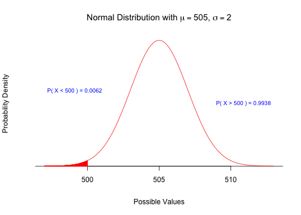
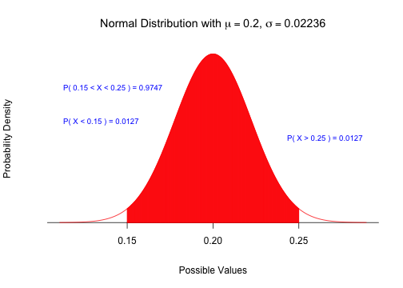
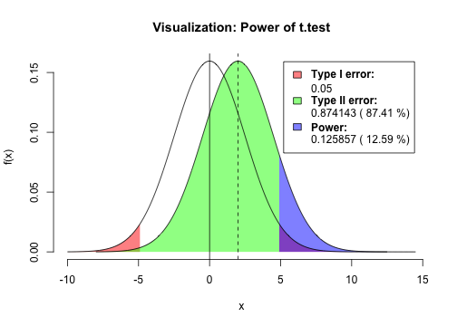

---
title: Quiz 3 Solutions
subtitle: MGCR 271
author: Ramnath Vaidyanathan
widgets: [mathjax, quiz, bootstrap]
mode: selfcontained
url: {lib: ../quiz1/libraries}
--- &radio

## Question 1

"Which of the following statements is INCORRECT about the sampling distribution of the sample mean?"

1. The standard error of the sample mean will decrease as the sample size increases.
2. The sample mean is unbiased for the true (unknown) population mean.
3. The sampling distribution shows how the sample mean will vary among repeated samples.
4. _The sampling distribution shows how the sample was distributed around the sample mean._

--- &radio

## Question 2

"Cans of peanuts have a stated net weight of 500g.  However, due to variation in the canning process, the actual net weight has an approximate normal distribution with a mean of 505g and a standard deviation of 10g.  According to Consumer Affairs, a sample of 25 cans should have less than a 5% chance that the mean weight is less than 500g. What is the actual probability that a sample of 25 cans will have a mean weight less than 500g?"

1. 0.1915
2. 0.3085
3. 0.0228
4. _0.0062_

*** .explanation

The sampling distribution of mean weights, $\bar{X}$ will be normal with mean $\mu = 505$ and standard deviation $\sigma = 10/\sqrt(25)$. Hence, P($\bar{X}$ > 500) can be computed as

 

--- &radio

## Question 3

"A random sample of 100 students from a high school was selected.  If a 98% confidence interval estimate for the mean age of students is calculated to be 14.2511 to 14.9489, then the standard deviation of the sample mean is:"

1. _0.15_
2. 0.35
3. 1.8
4. 2.25

*** .explanation

We know that the sample means follow a t-distribution with $df = 100 - 1 = 99$. Hence, the t-stat corresponding to a 98% confidence interval is given by $t^{*} = 2.3646$. From the data, we know that the margin-of-error is given by moe = (14.9489 - 14.2511)/2, which equals 0.3489. 

We know that moe = tstar x se. Hence se = moe/tstar, which gives us se = 0.1476.

NOTE: The question asks you for the __standard deviation of the sample mean__, which is the standard error. Many of you assumed that the question asked for the standard deviation of the __sample__ and hence divided your answer by the square root of the sample size. 

--- &radio

## Question 4

"A union survey of workers who were laid off between 2004 and 2006 found that 20% were out of work for at least one year.  Suppose a random sample of 320 workers was drawn from among all workers laid off between 2004 and 2006.  What is the probability that the sample proportion of workers out of work for at least one year differs by at most 5% from the proportion obtained in the union survey?"

1. 0.968
2. _0.9750_
3. 0.9506
4. 0.9875

*** .explanation

We know that sample proportions follow a normal distribution, with mean $p = 0.20$ and standard deviation given by $\sqrt(\frac{\hat{p} \times (1 - \hat{p})}{n})$, which 0.0224. The probability that the sample proportion differs by at most 0.05 from the survey is given by $P(0.15 < \hat{p} < 0.25)$, which can be computed to equal __0.9747__.

 

--- &radio

## Question 5

"A random sample of 50 students chosen from an elementary school with 400 students was found to have a mean allowance of \\$26 per week with a standard deviation of \\$8.  Obtain a 98% confidence interval for the total amount of allowance money given to students in this school per week."

1. \\$9,531 to \\$11,269
2. \\$9,347 to \\$11,453
3. \\$10,028 to \\$10,772
4. _\\$9,414 to \\$11,386_

*** .explanation

The trick in this question is to multiply the confidence interval you get for the mean allowance by the total number of students (which is 400) to get a confidence interval for the __total amount of allowance__.

--- &checkbox

## Question 6

Select ALL statements that are false?

1. For an exponentially distributed population, the sampling distribution of the sample mean is approximately normal when the sample size is greater than 30.
2. _The t-distribution should always be used whenever n is small._
3. _For a fixed sample size, as confidence decreases so does precision._
4. The standard deviation of the sample mean increases as the standard deviation of the population increases.

*** .explanation

- T: When > 25, sampling distribution is approximately normal (CLT)
- F: It depends. For example, while testing proportions we use the normal distribution even when n is small.
- F: As confidence decreases, precision increases for a fixed sample size.
- T

--- &radio

## Question 7

A credit manager has chosen a sample of size 2,164 to estimate the mean balance of credit accounts to within \\$0.50.  A pilot study of 50 accounts had a mean of \\$1,219 and a variance of 100.  The level of confidence of the interval is:

1. 90%
2. 95%
3. _98%_
4. 99%

*** .explanation

From the pilot study, we get $\bar{x} = 1219$ and $s = 10$. Hence,  the standard error of the sample mean, for a sample of size 2164 is given by $s/\sqrt{2164} = 0.215$. Since, we know that $moe = t^{*} \times se$, equals 0.50, we can solve for $t^{*} = 0.50/0.215 = 2.326$. The corresponding confidence level can hence be found to be 98%

 

--- &radio

## Question 8

The standard deviation of the sentences received by those convicted of first degree murder is known to be 5.84 years and first degree murder sentences are normally distributed.  If a random sample of 17 persons convicted of first degree murder is selected and found to have a mean sentence of 24.06 years, find a 95% confidence interval estimate for the true mean sentence received by those convicted of first degree murder.

1. 21.057 to 27.063
2. 21.730 to 26.390
3. _21.284 to 26.836_
4. 20.411 to 27.709

*** .explanation

The 95% CI can be calculated as $24.06 \pm 1.96 \times \frac{5.84}{\sqrt{17}}$, which gives us (21.284, 26.836)

--- &radio

## Question 9

A recent Gallup Poll dealt with the proportion of Canadians who favoured the various Prime Ministers. It found that only Pierre Trudeau did quite well, of all Prime Ministers in recent memory, and that the proportion favouring Brian Mulroney is quite low.  A newspaper article included the following statement:  “Results are based on 1,037 interviews with Canadian adults conducted July 6 - 9, 2006.  Gallup says a sample this size is accurate within 4 percentage points, 19 in 20 times”.  In fact, the precision of their estimate of the population proportion was not 4 percentage points.  Find the closest precision below, when estimating the population proportion at 50%.

1. 0.02
2. 0.025
3. _0.030_
4. 0.035

*** .explanation

The margin of error for a 95% CI can be computed as $1.96 \times \sqrt{\frac{p(1-p)}{n}}$, where p = 0.50 and n = 1037. This gives us the precision to be 0.0304.
 

--- &radio

## Question 10

"The federal government claims that new college graduates earn an average of \\$45,000 in their first year after graduation.  A random sample of new graduates gave a sample average of \\$42,157 and a 95% confidence interval was found to be (\\$40158, \\$44156).  This interval is interpreted to mean that:"

1. 95% of all values of the population lie in the interval.
2. If we were to repeat our survey many times, then about 95% of all the confidence intervals will contain the value \\$45,000.
3. _If we repeat our survey many times, then about 95% of our confidence intervals will contain the true value of the average first year earnings._
4. There is a 95% probability that the first year earnings is between \\$40158 and \\$44156 for all new graduates.

*** .explanation

The correct answer is (C), which is the basic definition of a confidence interval.

--- &radio

## Question 11

A turkey producer knows from previous experience that profits are maximized by selling turkeys when their average weight is 12 kilograms.  Before determining whether to put all their full grown turkeys on the market this month, the producer wishes to estimate their mean weight.  Prior knowledge indicates that turkey weights have a standard deviation of around 2 kilograms. The number of turkeys that must be sampled in order to estimate their true mean weight to within 0.5 kilograms with 95% confidence is:

1. 35
2. 5
3. _62_
4. 200

*** .explanation

We know that $moe=z^{*}\times\dfrac{\sigma}{\sqrt{n}}$. Here, we are given that moe= 0.5, $\sigma = 2$ and $z^{*} = 1.96$. Plugging all the known values into this equation, we can compute the required sample size to be $n = 62$.
 

--- &radio

## Question 12

"A Gallup poll of 1,000 adults found 350 supported the policies of a particular political party.  A 95% confidence interval for the true level of support in the entire Canadian population is:"

1. (.300, .400)
2. (.315, .385)
3. _(.320, .380)_
4. (.290, .410)

*** .explanation

A 95% CI is given by 

$$\hat{p}\pm z^{*}\times\sqrt{\frac{\hat{p}(1-\hat{p})}{n}}$$. Plugging in the values $\hat{p} = 0.35$, n = 1000 and $z^{*} = 1.96$, we can compute the confidence interval to be (0.32,0.38).

--- &radio

## Question 13

"You would like to estimate the percentage of “regular users” of vitamins in a large population and you would like your estimate to be accurate to within 5 percentage points, 19 times out of 20. Approximately how large should your sample size be?"

1. _384_
2. 1536
3. 1082
4. 541

*** .explanation

We know that the margin-of-error is given by

$$m=z^{*}\times\sqrt{\frac{\hat{p}(1-\hat{p})}{n}}$$,

where $z^{*} = 1.96$ for a 95% CI. Since we are not given an estimate for $\hat{p}$, we use the worst-case-scenario (See pg 465 in the book) and use $\hat{p} = 0.5$. Plugging in the values, we get $n = 384$.

--- &checkbox

## Question 14

"Select ALL statements that are false?" 

1. _The power of a test is the probability of rejecting a null hypothesis when it is true._
2. In the test of hypothesis for the claim that the mean grade of students in a statistics course is more than 70%, the type II error would consist of concluding that the mean is 70% or less when in fact it is greater than 70%.
3. _Increasing the sample size will increase the value of alpha and decrease the value of beta._
4. The larger the difference between the value of the population mean and the hypothesized value, the smaller beta will be.

--- &checkbox

## Question 15

"Select ALL statements that are true?"

1. In an upper tail test of hypothesis for a population mean the decision rule is to conclude H0 if the test statistic is greater than the action limit and to conclude H1 otherwise.
2. _A statistical test of hypothesis is performed under the assumption that the null hypothesis is true._
3. A test of hypothesis for a population mean is called a lower tail test if the decision rule is to conclude H1 if the test statistic is greater than the critical value.
4. _In the test of hypothesis for the claim that the mean grade of students in a statistics course is more than 70%, the type II error would consist of concluding that the mean is 70% or less when in fact it is greater than 70%._

--- &radio

## Question 16

"A human resources consultant to a large company claims that at most 40% of managers are dissatisfied with office politics.  A random sample of 200 managers had 90 who expressed dissatisfaction with office politics.  The p-value for this test of hypothesis is ____________ and the correct conclusion is __________ at the 5% level of significance."

1. 0.0749  Conclude more than 40% are dissatisfied
2. _0.0749  Conclude that 40% or fewer are dissatisfied_
3. 0.0778 Conclude more than 40% are dissatisfied
4. 0.0778  Conclude that 40% or fewer are dissatisfied

*** .explanation

--- &radio

## Question 17

"A random sample of 7 values chosen from a normally distributed population is as follows: (70.7, 81.6, 77.9, 89.2, 68.3, 86.0, 73.5).  A manager claims that the mean of this population does not exceed 75.  The standardized test statistic is ________."

1. 3.05
2. 1.15
3. 2.83
4. _1.07_

*** .explanation

The standardizes test statistic is a z-statistic, which can be computed as

$$z=\frac{\bar{x}-75}{s/\sqrt{7}}$$,

where $\bar{x}$ and $s$ are the sample mean and standard deviation. Plugging in the values, we get $z = 1.07$.

--- &radio

## Question 18

"A sample of 50 items is selected to determine whether or not to accept the hypothesis that a population means differs from a value of 20.  The sample mean and standard deviation are 18 and 7 respectively.  The null hypothesis is not rejected, which of the following is a possible value for the level of significance associated with this test?"

1. 10%
2. 8%
3. _2%_
4. 5%

*** .explanation

We can compute the test statistic for this hypothesis test as 

$$z=\frac{18-20}{7/\sqrt{50}}$$,

which gives us a p-value of p = 0.0217. As the null hypothesis is not rejected, the significance level is smaller than 0.0217. The only value satisfying this condition is (C) 2%.

--- &radio

## Question 19

"A management consultant has analysed a random sample of 40 large firms in order to investigate the mean annual salary of sales managers.  She has constructed the following 90% confidence interval for the population mean annual salary: \\$45,382 to \\$48,618.  In testing the hypothesis that the population mean annual salary is \\$50,000 she should:"

1. Conclude H0 at the 5% level of significance
2. Conclude H0 at the 10% level of significance
3. Conclude H1 at the 5% level of significance
4. _Conclude H1 at the 10% level of significance_

*** .explanation

A 90% CI translates to a significance level of 10%. Since the population mean is NOT contained in the 90% CI, we can conclude that we would reject the null hypothesis (and hence conclude H1) at the 10% significance level.

--- &radio

## Question 20

"Consider the test of hypothesis to determine whether or not to accept the hypothesis that a population means differs from a value of 120.  Sample data for the test are as follows: sample size = 150, the sum of X = 17000, sample standard deviation = 30.  The level of significance for the test is 5%.  The value of beta when the population mean is equal to 122 is __________."

1. _0.8702_
2. 0.1298
3. 0.8729
4. 0.1271

*** .explanation

 

--- &radio

## Question 21

"The Dean of a university claims that no more than 10% of the students drop out of university.  She chooses a random sample of 500 students and decides that she will accept the claim only if no more than 25 of the 500 students drop out of university.  In fact her claim is true - the actual percentage of students who drop out of university is 8%; nevertheless the sample had 30 students who drop out. Based on the sample data the Dean would make a ________ error."

1. Type II
2. _Type I_
3. Cannot be determined
4. No error is being committed

*** .explanation

The Dean rejects the null hypothesis, when in fact it is TRUE. So he is committing a Type I error.

--- &radio

## Question 22

"A study is to be conducted to determine whether the mean cost of repairing a car is more than \\$500. A random sample of 100 repairs is selected and the following decision rule is constructed: conclude the null hypothesis if the sample mean is less than or equal to \\$515, otherwise conclude the alternative hypothesis.  The standard deviation of repair costs is known to be \\$100.  What is the beta-risk if the population mean is actually \\$505?"

1. _0.8413_
2. 0.1587
3. 0.3085
4. 0.6915

*** .explanation

Type II error is calculated as the Pr(Not Rej H0 | Ha is TRUE), which equals $P(\bar{X} < 515 \mid \mu = 505)$. Computing the z-score, we get

$$z=\frac{515-505}{100/\sqrt{100}}$$, 

which equals 1. Hence, we get P(Z < 1) = 84% (think 68-95-99.7 rule).

--- &checkbox

## Question 23

Select ALL statements that are true?

1. In testing the hypothesis for the equality of two population proportions, the acceptance region for the null hypothesis will be wider than the confidence interval for two population proportions, assuming the same value of alpha.
2. A 95% confidence interval estimate for the difference between two population proportions is always symmetrical with zero at the center of the interval.
3. _The test of hypothesis for the equality of two population means based on independent samples with 12 observations from each population will have 22 degrees of freedom._
4. _A quality control manager claims that the proportion of defective units produced by machine I (Population 1) is less than the proportion produced by machine II (Population 2). The correct null hypothesis is Ho: p1 – p2 \>= 0._

--- &checkbox

## Question 24

Select ALL statements that are true?

1. Increasing alpha also increases the value of confidence.
2. _The smaller the difference between the values of the population means which satisfy Ho and H1, the larger the beta-risk._
3. _There exists a different value for beta for each possible value of the population mean that satisfies the alternative hypothesis._
4. In a lower tail test of hypothesis, the power decreases as the population mean which satisfies the alternative hypothesis decreases.

*** .explanation

The beta-risk is Type II error, which is the probability of NOT  rejecting H0, when H0 is FALSE. Clearly, the value of beta depends on the value of the population mean according to the alternate hypothesis. Moroever, greater the difference between the value of the population means according to H1 and H0, the higher is the value of beta. (If you are not convinced, use one of the numericals in this quiz, and change the value of $\mu_a$ to observe the effect on $\beta$).

--- &checkbox

## Question 25

Select ALL statements that are true?

1. _A 95% confidence interval estimate of a population mean is 36.71 to 54.29.  Then the correct conclusion for a two-tailed test with a hypothesized , mean of 60 based on this confidence interval, at the 5% level of significance, must be to conclude Ho._
2. A test of hypothesis is found to have a p-value of .073.  Then one should conclude H1 if the level of significance is 10% and conclude Ho if the level of significance is 5%.
3. In a lower-tail test, if the p-value is less than alpha, then the test statistic would be less than the action limit.
4. _A statistical test of hypothesis is performed under the assumption that the alternative hypothesis is true._

--- &radio

## Question 26

If the p-value of a hypothesis test for a population mean was 0.16, and the level of significance is 2%, what would the correct conclusion be?

1. _Do not reject the null hypothesis_
2. Reject the null hypothesis
3. Cannot be determined
4. The sample mean is significantly different from the hypothesized value.

*** .explanation

Since $p > \alpha$, we would NOT reject the Null Hypothesis. The only answer supporting this conclusion is (A).

--- &radio

## Question 27

Consider a two-tailed test with a hypothesized mean of 50.  The sample size is 120.  The following results are known: the sum of all sample values is 6120 and the sample standard deviation = 4.80.  If the test is performed at the 5% level of significance, the p-value is __________ and the correct conclusion is ___________.

1. 0.9774; Conclude Ho
2. 0.9887; Conclude Ho
3. 0.0113; Conclude H1
4. _0.0226; Conclude H1_

*** .explanation

We can compute the t-statistic as

$$t=\frac{51-50}{4.8/\sqrt{120}}=2.28$$.

From the t-table, we get that the area to the RIGHT of t = 2.28 is 0.013. Since it is a two-tailed test, the p-value is 2 x 0.013 = 0.026. As $p < \alpha$, we reject H0 and conclude H1.

--- &radio

## Question 28

A VP of manufacturing claims that more than 3% of items produced using a certain assembly line are is defective.  A random sample of 100 items from the assembly line had 4 defectives. At the 5% level of significance, which of the following would be part of the standardized decision rule?

1. Conclude Ho if TS is greater than or equal to 1.645
2. _Conclude Ho if TS is less than or equal to 1.645_
3. Conclude Ho if TS is greater than or equal to 1.960
4. Conclude Ho if TS is less than or equal to 1.960

*** .explanation

For a right-tailed test with significance level of 5%, the critical test statistic equals 1.645, and we would reject H0 if t > 1.645. Since, all the answers are about rejecting H0, we can restate our decision rule as reject H0 if t <= 1.645, which is (B). 

--- &radio

## Question 29

A VP of manufacturing claims that at most 3% of items produced using a certain assembly line are is defective.  A random sample of 100 items from the assembly line had 4 defectives. At the 5% level of significance, the standardized test statistic for the test of hypothesis is:

1. _0.59_
2. 0.03
3. 0.51
4. 0.04

*** .explanation

We can compute the standardized test statistic as

$$z=\frac{0.04-0.03}{\sqrt{\frac{0.03(1-0.03)}{100}}}=0.59$$

Note that you use the hypothesized value of the population proportion (which is 0.03) to compute the standard error, instead of the sample proportion (which is 0.04).

--- &radio

## Question 30

A random sample of 144 observations had a mean of 115 and a standard deviation of 30.  We wish to test the hypothesis that the population mean is 120 at the 5% level of significance.  What is the power of the test when the population mean is 118?

1. 0.8741
2. 0.95
3. _0.1259_
4. 0.05

*** .explanation

 

--- &radio

## Question 31

Consider the test of hypothesis to determine if the population mean is more than 50 at the 1% level of significance.  The sample data for the test is: n = 64,  x-bar = 46, s = 15.  If the probability of a Type II error is .9664, then the value of the population mean at which this value is controlled is closest to:

1. 45.6
2. _50.9_
3. 42.2
4. 48.6

*** .explanation

The z-statistic corresponding to $\alpha = 0.01$ can be computed as 2.3263, while the z-statistic corresponding to $\beta = 0.9664$ can be computed as 1.8303. Hence, the difference between the alternate and null means can be calculated as

$$(2.3263 - 1.8303) \times \frac{15}{\sqrt{64}}$$,

which simplifies to 0.93. Hence, the value of the population mean according to the alternate is given by 50 + 0.93.

--- &radio

## Question 32

The Vancouver Chamber of Commerce claims that the mean cost of hotels in the downtown area of the city is less than in Edmonton.  A random sample of 50 hotels in Vancouver (population 1) had a mean nightly rate of \\$109 with a standard deviation of \\$15.  An independent sample of 60 hotels in Edmonton (population 2) had a mean nightly rate of \\$114 with a standard deviation of \\$12.  In testing the hypothesis with a 2% level of significance, what is the value of the standardized test statistic and the correct conclusion?

1. -1.9035;  conclude H1
2. -1.9422;  conclude Ho
3. -1.9422;  conclude H1
4. _-1.9035;  conclude Ho_

*** .explanation

We can compute the standard error for the difference between the two sample means as sqrt(15^2/50 + 12^2/60), which gives us 2.6268. Hence, the standardized test statistic is given by (109 - 114)/2.6268, which gives us 0.

Since, the critical test statistic is t* = -2.1099, we cannot reject the null hypothesis H0.

--- &radio

## Question 33

Consider the test of hypothesis for the equality of two population means.  The sample data from the first population is: n = 10,  x-bar = 52.4, s = 5.  The sample data from the second population is: n = 8,  x-bar = 48.2, s = 6.  Both variables are normally distributed and the population variances are assumed to be equal.  The estimate of the standard deviation of the difference in sample means based on these data is:

1. 6.71
2. _2.59_
3. 5.46
4. 1.23

*** .explanation

We can compute the pooled variance estimate as ((10 - 1)*5^2 + (8 - 1)*6^2)/(10 + 8 - 2), which equals 29.81. Hence, the standard error is computed as sqrt(29.81/10 + 29.81/8), which equals __2.589__.

--- &radio

## Question 34

"A random sample of 150 investment bankers (population 1) had thirty percent who expressed dissatisfaction with their choice of career.  A random sample of 200 financial analysts (population 2) had forty-two percent who expressed dissatisfaction.  In testing the hypothesis that a higher proportion of financial analysts than investment bankers are dissatisfied, the standard deviation of the difference in the two population proportions is approximated by ______________ and the standardized test statistic is ______________." 

1. .0027;  -2.303
2. .0027;  -44.44
3. _.0521;  -2.303_
4. .0521;  -44.44

--- &radio

## Question 35

"Consider an upper-tail test of hypothesis for the difference in two population means.  The sample data from the first population is: n = 50,  x-bar = 110, s = 10.  The sample data from the second population is: n = 75,  x-bar = unknown, s = 11.  We conclude the alternative hypothesis with a 2% level of significance.  Then the value of the second sample mean must be:"

1. at most 114.4
2. _less than 106.1_
3. less than 114.4
4. at least 106.1

--- &radio

## Question 36

"A test of hypothesis is performed to determine whether the proportion of Montrealers (population 1) who want the decriminalization of marijuana is greater than the proportion of Torontonians (population 2) who want decriminalization of marijuana.  A random sample of 120 Montrealers had 90 who favor while a random sample 150 Torontonians also had 90 who favor.  The level of significance of the test is 1%.  Then the classical action limit for the appropriate test of hypothesis is:"

1. -0.1343
2. 0.1487
3. -0.1487
4. _0.1343_

--- &radio

## Question 37

"A company produces pesticides.  A new product DieBug (Population 1) is to be compared with the product currently in use, Blastem (Population 2).  Two rooms of equal size are sprayed with the same amount of spray, room #1 with DieBug and room #2 with Blastem.  Three hundred insects are released into room #1 and four hundred in room #2.  After 30 minutes the number of dead insects are is counted.  195 dead insects were found in room #1 and 275 dead insects were found in room #2.  What is the standard deviation of p-bar1 minus p-bar2?"

1. 0.4697
2. 0.2206
3. 0.0013
4. _0.0359_

--- &radio

## Question 38

"A recent drop in the value of the Canadian dollar versus foreign currencies is expected to increase the value of Canadian exports.  A comparison of the current year's (Population 2) versus last year's (Population 1) shipments (in thousands of dollars) for each of six Canadian exporters is given as follows: (4.77, 4.34), (5.16, 5.89), (2.73, 2.52), (4.39, 3.91), (5.25, 4.99), (3.80, 3.24).  It is assumed that the population of differences between the current year’s and last year's shipments is approximately normal.  Then, a 95% confidence interval estimate for the mean difference is:"

1. -0.5926 to 0.1893
2. _-0.7005 to 0.2972_
3. -0.6765 to 0.2731
4. -0.5787 to 0.1753

--- &radio

## Question 39

A company with two plants producing the same product, but with two slightly different manufacturing processes, conducted a sample study at each of the two plants with the following results: The sample statistics from the first group are: n = 40, x-bar = 18, s = 4.2. The sample statistics from the second group are: n = 50, x-bar = 20, s = 4.  In testing the hypothesis that the mean time to produce the product is the same at both plants, what is the p-value of the test?

1. .0110
2. .0516
3. _.0220_
4. .1032

